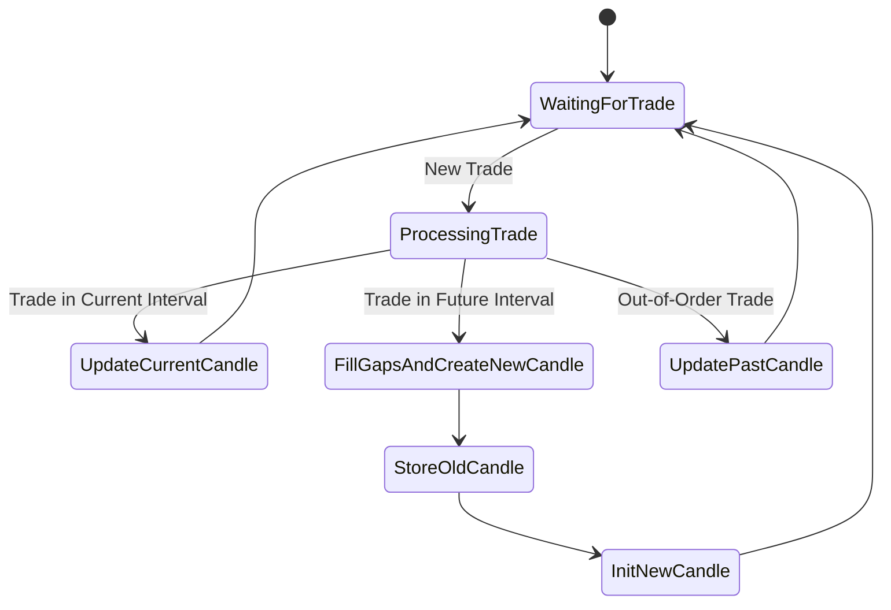

# Candle Generator (intuition-rust)

## Quick Start

```rust
use candle_generator::*;
use chrono::Utc;

let instrument = Instrument {
    pair: Pair { base_id: "BTC".into(), quote_id: "USDT".into() },
    exchange: "binance".into(),
    market_type: MarketType::Spot,
};
let mut gen = CandleGenerator::new(
    vec![Timeframe::m1, Timeframe::m5, Timeframe::h1],
    instrument.clone(),
    UsdtVolumeSource::Fixed(1.0),
);

gen.add_trade(Trade {
    instrument: instrument.clone(),
    id: "t1".into(),
    price: 50000.0,
    amount: 0.1,
    side: Side::Buy,
    timestamp: Utc::now(),
});

let candles = gen.get_candles(Timeframe::m1, 10);
```

## Features
- Terminology-strict, AGI-ready, modular, and exchange-agnostic
- Protobuf-first: all types/messages in `/proto`, Rust via `prost`/`tonic`
- Strict aggregation chain: m1→m5→m15→m30→h1→h4→d1
- USDT volume calculation (fixed/callback/none)
- High-performance bulk ingestion (sorted by default)
- Edge case handling: gaps, empty candles, out-of-order trades
- Optional metrics, super candle support (planned)
- Fast loading from CSV, Parquet, DuckDB, QuestDB (planned)

## Advanced Usage

### Bulk Ingestion
```rust
// Bulk load from a Vec<Trade> (must be sorted by timestamp ascending!)
gen.add_trades_bulk(&trades);
// Or from an iterator
gen.add_trades_iter(trades_iter);
```

### Loading from CSV/Parquet/DuckDB
```rust
// CSV
let mut rdr = csv::Reader::from_path("trades.csv")?;
let trades: Vec<Trade> = rdr.deserialize().collect::<Result<_,_>>()?;
gen.add_trades_bulk(&trades);

// Parquet (polars)
let df = polars::prelude::LazyFrame::scan_parquet("trades.parquet", Default::default())?.collect()?;
for trade in df.iter().map(|row| Trade::from_row(row)) {
    gen.add_trade(trade);
}

// DuckDB
let conn = duckdb::Connection::open("trades.db")?;
let mut stmt = conn.prepare("SELECT * FROM trades")?;
let trades_iter = stmt.query_map([], |row| Trade::from_row(row))?;
gen.add_trades_iter(trades_iter);
```

### Enabling Extra Metrics (Planned)
```rust
// Planned: enable buy/sell volume, VWAP, etc. via config or builder
// let mut gen = CandleGeneratorBuilder::new().enable_buy_sell_volume(true).build();
```

## Performance Benchmarks (Planned)
- Benchmarks will be provided to demonstrate millions of trades/sec ingestion on modern hardware.
- Users can run `cargo bench` to test on their own data.

## Extensibility & Customization
- **Custom Metrics:** Planned metrics pipeline will allow users to register custom metrics for each candle.
- **Proto Extension:** To add new fields, extend the relevant `.proto` file in `/proto`, then regenerate Rust types with `prost`/`tonic`.
- **New Data Sources:** Integrate with any source (CSV, Parquet, DuckDB, QuestDB, Arrow, etc.) via bulk/iterator APIs.

## FAQ / Best Practices
- **How do I maximize speed?** Always provide sorted trades, use bulk ingestion, and enable only the metrics you need.
- **Can I use unsorted trades?** Yes, but it will be much slower. (Planned: `add_trades_bulk_unsorted` or `sorted: bool` parameter.)
- **What is "super candle" mode?** Opt-in mode for 50-200+ metrics per candle; only enable for research/analytics, not for HFT.
- **How do I add a new metric?** (Planned) Register via the metrics pipeline or extend the proto and Rust types.

## Roadmap & Optional Features

| Feature                        | Status     | Details/Link                       |
|------------------------------- |----------- |------------------------------------|
| Bulk ingestion (sorted)        | ✅         | High-speed, millions/sec           |
| Bulk ingestion (unsorted)      | Planned    | Slower, for out-of-order data      |
| Extra metrics (buy/sell, etc.) | Planned    | Optional, via config/pipeline      |
| Super candle (100+ metrics)    | Planned    | Opt-in, for research/analytics     |
| Candle history limit           | Planned    | Configurable memory usage          |
| Thread safety                  | Planned    | For multi-threaded use             |
| Multi-instrument support       | Planned    | Aggregate multiple instruments     |
| Event/callback subscriptions   | Planned    | Subscribe to candle events         |
| Raw mode for backfill          | Planned    | Max speed, skip edge-cases         |
| CSV/Parquet/DuckDB/QuestDB     | Planned    | Direct, zero-copy ingestion        |
| Metrics pipeline               | Planned    | Custom/user metrics, single-pass   |
| Proto extensibility            | ✅         | See below                          |
| See `/tasks/candle_generator.md` for full details and progress. |

## How to Track Progress
- The single source of truth for requirements, reasoning, and progress is [`/tasks/candle_generator.md`](./tasks/candle_generator.md).
- Every feature, design decision, and implementation step is logged there.
- **All changes must update both this README and the task file.**

## Contribution Guidelines
- Propose new metrics, data sources, or features via issues or PRs.
- Follow terminology in `.cursor/rules/terms.md`.
- All changes must update this README and `/tasks/candle_generator.md`.
- For new metrics, provide a performance impact estimate and a use case.
- Add tests for all new features and edge cases.
- Extend proto schemas as needed and regenerate Rust types.

## Contact & Community
- For questions, ideas, or to join the project, open an issue or PR on GitHub.
- For strategic partnership or AGI research collaboration, contact the project maintainer directly.

---

This README, together with `/tasks/candle_generator.md`, is your complete, actionable hub for building the world's most advanced, terminology-strict, AGI-ready candle generator.

## Candle Generation Algorithm

The candle generator follows a strict, high-performance algorithm inspired by industry standards and the Go reference implementation. It robustly handles gaps, out-of-order trades, and strict aggregation chains.



**States and Transitions:**
- **WaitingForTrade**: Wait for the next trade event.
- **ProcessingTrade**: A new trade arrives; determine its candle interval.
- **UpdateCurrentCandle**: Trade is in the current (open) candle; update OHLCV and metrics.
- **FillGapsAndCreateNewCandle**: Trade is in a future interval (gap detected); fill missing candles, create new candle.
- **UpdatePastCandle**: Trade is out-of-order (belongs to a past interval); update the corresponding past candle.
- **StoreOldCandle**: Store the completed candle before starting a new one.
- **InitNewCandle**: Initialize a new candle with the trade's data.

**Aggregation Chain:**
- m1 candles are built from trades.
- m5 from m1, m15 from m5, m30 from m15, h1 from m30, h4 from h1, d1 from h4.
- Each higher timeframe is aggregated only when the lower timeframe completes the required number of intervals.
